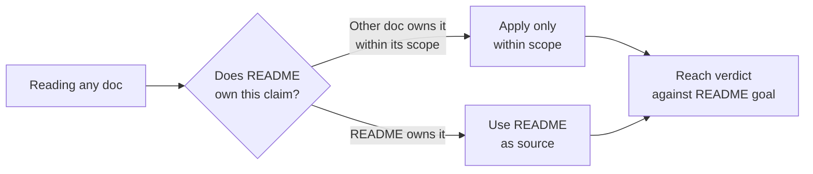

# Session bootstrap — read first

> **Trigger:** every session start, before any other action.
> **Why:** persists project goal + invariants across context compaction. Implements AIF Step 0 / Cline re-read pattern — more robust than CLAUDE.md compaction-block which depends on compactor cooperation.
>
> **Authoritative for:** operational restatement of project goal + invariants for AI session start; reading order; reviewer drift-prevention check.
> **NOT authoritative for:** project goal, methodology, design invariants — see [README.md#why-this-exists](../README.md#why-this-exists). This file's goal section delegates upward — it cannot drift because it is a pointer.

## Goal (do not redefine)

AI agents can't silently bypass undocumented conventions. Every rule is an executable artifact that fails at the earliest reachable channel — edit-time → pre-commit → pre-push → CI → production audit. **CI = last-resort gate.** See [README.md#why-this-exists](../README.md#why-this-exists) for full statement and «what must not break» invariants.

## Methodology (do not elevate to goal)

Recursive self-application — framework validates itself via own logic. Quality signal (GCC bootstrap precedent, `rustc` compile-self analogy), not the project's goal.

## Invariants snapshot

| # | Invariant | Enforcement | Source |
|---|---|---|---|
| 1 | Build-vs-reuse SSOT consult before capability commit + macro-level build-first-reuse-default discipline | `Prior-art:` trailer + pre-push hook | [docs/meta-factory/prior-art-evaluations.md](../docs/meta-factory/prior-art-evaluations.md), [.claude/rules/build-first-reuse-default.md](rules/build-first-reuse-default.md) |
| 2 | Recursive self-application — framework's own audits green | `make self-audit` + principles meta-tests | [packages/core/principles/](../packages/core/principles/) |
| 3 | Search-coverage discipline — 6-item checklist on negative-existence claims | rule consumed by phase research sessions | [.claude/rules/phase-research-coverage.md](rules/phase-research-coverage.md) |
| 4 | Multi-channel enforcement — every rule fails at earliest reachable channel | edit-time → pre-commit → pre-push → CI → production audit; CI = last-resort gate | [README.md#why-this-exists](../README.md#why-this-exists) |

## Reading order for new context

1. **[README.md](../README.md)** — goal hierarchy (authoritative for goal / methodology / invariants)
2. **This file** — operational restatement for current session
3. **[CLAUDE.md](../CLAUDE.md)** — AI-tooling conventions + Artifact Ownership Contract
4. Task-specific docs (EXECUTION-PLAN, retros, research, prior-art-evaluations) — **operational**, NOT goal-redefining

## Reviewer drift-prevention check

When evaluating any doc claim that reads as «authoritative for the project», apply this:

If you find yourself reasoning under a goal that contradicts README — stop. The contradicting doc has drifted, not README. Surface as a coverage-gap patch under [docs/meta-factory/research-patches/](../docs/meta-factory/research-patches/).

## When this file needs updating

- New invariant added to project — append row to invariants table
- Reading order changes (e.g. new always-loaded doc adopted) — update list
- Reviewer drift-prevention pattern evolves — update Mermaid

**Do not modify the goal/methodology sections** — they delegate to README. If README changes, this file is automatically stale until refreshed manually.
